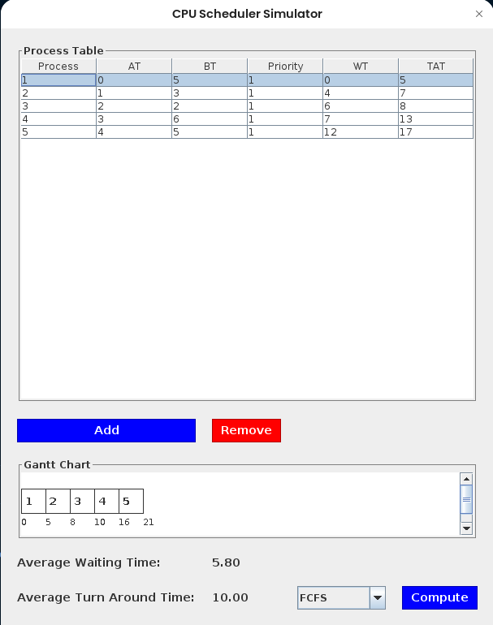

# OS-LAB-PROJECT
 
# Title: CPU Scheduler GUI

## Description:
This GitHub repository contains the source code for a CPU Scheduler Simulator with a graphical user interface (GUI) implemented in Java Swing. The simulator allows users to visualize various CPU scheduling algorithms such as First Come First Serve (FCFS), Shortest Job First (SJF), Shortest Remaining Time (SRT), Priority (Non-Preemptive and Preemptive), and Round Robin (RR).

## Key Features:

### Graphical User Interface (GUI): 
The application provides a user-friendly GUI for interacting with the CPU scheduling simulator.
### Process Table:
Users can input process details such as arrival time (AT), burst time (BT), and priority directly into the process table.
### Gantt Chart: 
The Gantt chart visually represents the scheduling timeline, illustrating the execution order of processes.
### CPU Scheduling Algorithms:
Supports various CPU scheduling algorithms, including FCFS, SJF, SRT, Priority (NP and P), and RR.
### Dynamic Interaction:
Users can add or remove processes, compute schedules based on selected algorithms, and observe the average waiting time (WT) and average turnaround time (TAT).
## How to Use:

Clone the repository to your local machine.
Open the project in your preferred Java IDE.
Compile and run the GUI class (GUI.java).
Use the GUI to interact with the CPU Scheduler Simulator:
Add or remove processes.
Select a scheduling algorithm from the dropdown menu.
Click the "Compute" button to generate the schedule and view results.
Observe the Gantt chart, average waiting time, and average turnaround time for the selected algorithm.
This project serves as an educational tool for understanding CPU scheduling algorithms and their impact on system performance. It can be extended further with additional features or enhancements to support more advanced scheduling strategies.

## MEMBERS:
- Muneeb Khan
- Muhammad Hammad Ayub
- Ravi Shankar
- Hamayun Shahid

## Faculty:
- Asif Ali
